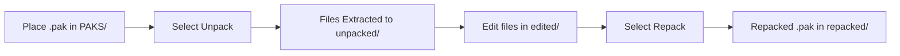
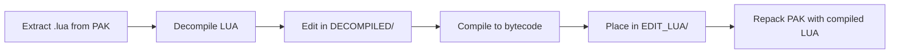

```markdown
<div align="center">
  
</div>

<div align="center">
  
[](https://github.com/CHEN-LITE/CHENTOOL)
[](https://www.python.org/)
[](https://termux.com/)
[](LICENSE)

[](https://t.me/CHEN_TOOL2)
</div>

---

## 📖 Table of Contents

- [✨ Features](#-features)
- [📦 Tools Included](#-tools-included)
- [🚀 Installation](#-installation)
- [⚙️ Requirements](#-requirements)
- [🎯 Usage Guide](#-usage-guide)
- [📂 Directory Structure](#-directory-structure)
- [🛠️ Commands Overview](#️-commands-overview)
- [📸 Screenshots](#-screenshots)
- [🤝 Contributing](#-contributing)
- [📞 Support](#-support)
- [📜 License](#-license)

---

## ✨ Features

### 🎯 Core Features
- ✅ **Multi-Tool Suite** - PAK, OBB, and LUA tools in one package
- ✅ **Fast Performance** - Optimized for mobile and desktop
- ✅ **Memory Efficient** - Uses mmap for large files
- ✅ **Cross-Platform** - Works on Android (Termux) and Linux
- ✅ **User-Friendly** - Rich CLI interface with progress bars
- ✅ **Auto Verification** - Manifest-based file tracking
- ✅ **Block-Level Repacking** - Preserve original compression

### 🔐 Supported Games
| Platform | Games |
|----------|-------|
| **BGMI** | Battlegrounds Mobile India |
| **PUBG** | PUBG Mobile Global |
| **KR** | PUBG Mobile Korea |
| **TW** | PUBG Mobile Taiwan |
| **JP** | PUBG Mobile Japan |
| **VNG** | PUBG Mobile Vietnam |

---

## 📦 Tools Included

### 1️⃣ **PAK Tool** (`1`)
```

🔧 Advanced PAK file manager with full support for:

· Version 12+ PAK files
· All encryption methods (SM4, Simple1, Simple2)
· ZLIB & ZSTD compression
· Block-level extraction
· Manifest-based repacking

```

### 2️⃣ **OBB Tool** (`2`)
```

📦 Fast OBB extraction and repacking:

· High-speed multi-threaded extraction
· No file size limits
· Auto-verification
· Compression level control (0-9)

```

### 3️⃣ **LUA Tool** (`3`)
```

📝 Complete LUA workflow:

· Decompile to readable code
· Compile back to bytecode
· Auto-optimization
· Source name preservation

```

### 4️⃣ **Main Launcher** (`chen`)
```

🚀 Central hub for all tools:

· Unified interface
· Color-coded menu
· Tool version management
· Quick access to all features

```

---

## 🚀 Installation

### For Android (Termux)

<details>
<summary><b>📱 Click for Termux Installation</b></summary>

```bash
# 1. Install Termux from F-Droid or Play Store
# 2. Open Termux and run:

# Update repositories
pkg update && pkg upgrade -y

# Install required packages
pkg install -y \
    python \
    python-pip \
    openjdk-17 \
    lua53 \
    binutils \
    file \
    unzip \
    zip \
    zlib \
    libzstd \
    git

# Install Python dependencies
pip install \
    rich \
    pycryptodome \
    zstandard \
    gmalg \
    requests \
    psutil \
    colorama

# Clone the repository
git clone https://github.com/CHEN-LITE/CHENTOOL.git

# Navigate to directory
cd CHENTOOL

# Make scripts executable
chmod +x *

# Run the tool
./chen
```

</details>

For Linux (Debian/Ubuntu)

<details>
<summary><b>🐧 Click for Linux Installation</b></summary>

```bash
# Update system
sudo apt update && sudo apt upgrade -y

# Install dependencies
sudo apt install -y \
    python3 \
    python3-pip \
    openjdk-17-jdk \
    lua5.3 \
    binutils \
    file \
    unzip \
    zip \
    zlib1g-dev \
    libzstd-dev \
    git

# Install Python packages
pip3 install \
    rich \
    pycryptodome \
    zstandard \
    gmalg \
    requests \
    psutil \
    colorama

# Clone repository
git clone https://github.com/CHEN-LITE/CHENTOOL.git
cd CHENTOOL

# Make scripts executable
chmod +x *

# Run
./chen
```

</details>

One-Line Installation

<details>
<summary><b>⚡ Quick Install (Copy & Paste)</b></summary>

For Termux:

```bash
pkg update && pkg upgrade -y && pkg install python python-pip openjdk-17 lua53 binutils file unzip zip zlib libzstd git -y && pip install rich pycryptodome zstandard gmalg requests psutil colorama && git clone https://github.com/CHEN-LITE/CHENTOOL.git && cd CHENTOOL && chmod +x * && ./chen
```

For Linux:

```bash
sudo apt update && sudo apt upgrade -y && sudo apt install python3 python3-pip openjdk-17-jdk lua5.3 binutils file unzip zip zlib1g-dev libzstd-dev git -y && pip3 install rich pycryptodome zstandard gmalg requests psutil colorama && git clone https://github.com/CHEN-LITE/CHENTOOL.git && cd CHENTOOL && chmod +x * && ./chen
```

</details>

---

⚙️ Requirements

Requirement Version Purpose
Python 3.8+ Core runtime
Java 17+ Lua decompilation
Lua 5.3 Lua compilation
Storage 1GB+ Working directory
RAM 512MB+ Processing
Internet Required Downloads

Python Packages

```bash
rich>=13.0.0          # Console UI
pycryptodome>=3.0.0   # AES encryption
zstandard>=0.18.0     # ZSTD compression
gmalg>=1.0.0          # SM4/ZUC algorithms
requests>=2.28.0      # HTTP requests
psutil>=5.9.0         # System monitoring
colorama>=0.4.0       # Terminal colors
```

---

🎯 Usage Guide

Launching the Tool

```bash
python menu.py
# or
python3 menu.py
```

Menu Options

```
┌─────────────────────────────────────────────────────────┐
│                      MAIN MENU                          │
├─────────────────────────────────────────────────────────┤
│  [1]  PAK Tool      - Unpack & Repack PAK files       │
│  [2]  OBB Tool      - Unzip & Repack OBB files        │
│  [3]  LUA Tool      - Decompile & Compile LUA         │
│  [4]  Exit          - Close application               │
└─────────────────────────────────────────────────────────┘
```

PAK Tool Workflow



OBB Tool Workflow


LUA Tool Workflow



---

📂 Directory Structure

```
/storage/emulated/0/Download/CHENTOOL/
│
├── PAK_TOOL/
│   ├── PAKS/              # Place original .pak files here
│   ├── unpacked/          # Extracted files
│   │   └── [pak_name]/
│   │       ├── edited/    # ← Place modified files here
│   │       └── manifest.json
│   ├── repacked/          # Compiled .pak files
│   └── extracted/         # Block-level extraction
│
├── OBB_TOOL/
│   ├── OBBS/              # Place original .obb files here
│   ├── unzipped/          # Extracted OBB contents
│   └── repacked/          # Compiled .obb files
│
└── LUA_TOOL/
    ├── PAKS/              # .pak files for LUA extraction
    ├── unpacked/          # Extracted .lua files
    ├── repacked/          # Repacked with compiled LUA
    ├── Manifest/          # PAK manifests
    ├── LUA_ORIGINAL/      # Original .lua backups
    ├── DECOMPILED/        # Decompiled readable .lua
    ├── EDIT_LUA/          # ← Place edited .lua files here
    └── COMPILED/          # Compiled .luac bytecode
```

---

🛠️ Commands Overview

PAK Tool Commands

Command Description
1 Unpack PAK file
2 Repack PAK file
3 Decrypt LUA files
4 Compile LUA files
5 How to use

OBB Tool Commands

Command Description
1 Unzip OBB file
2 Repack OBB file
3 Verify OBB file
4 Exit

---

📸 Screenshots

<details>
<summary><b>🖥️ Click to view screenshots</b></summary>

Main Menu

```
╔══════════════════════════════════════════════════════════╗
║  ██████╗██╗  ██╗███████╗███╗   ██╗    ████████╗ ██████╗ ║
║  ██╔════╝██║  ██║██╔════╝████╗  ██║    ╚══██╔══╝██╔═══██╗║
║  ██║     ███████║█████╗  ██╔██╗ ██║       ██║   ██║   ██║║
║  ██║     ██╔══██║██╔══╝  ██║╚██╗██║       ██║   ██║   ██║║
║  ╚██████╗██║  ██║███████╗██║ ╚████║       ██║   ╚██████╔╝║
║   ╚═════╝╚═╝  ╚═╝╚══════╝╚═╝  ╚═══╝       ╚═╝    ╚═════╝ ║
╠══════════════════════════════════════════════════════════╣
║  Developer: @CHENTOOL2    │    Tool: CHEN TOOL V4.5    ║
╚══════════════════════════════════════════════════════════╝

═══════════════════════════════════════════════════════════════
  ✦ ────────────────────────────────────────── ✦
  • Update by | @CHENTOOL2
  • Platform       : BGMI | PUBG | KR | TW | JP | VNG
  • Tool Version   : 4.5
  ✦ ────────────────────────────────────────── ✦

───────────────────────────────────────────────────────────────
MAIN MENU
───────────────────────────────────────────────────────────────
  1. PAK Tool
  2. OBB Tool
  3. LUA Tool
  4. Exit
───────────────────────────────────────────────────────────────

Select option (1-4):
```

</details>

---

🤝 Contributing

How to Contribute

1. Fork the repository
2. Create a feature branch
   ```bash
   git checkout -b feature/amazing-feature
   ```
3. Commit your changes
   ```bash
   git commit -m 'Add amazing feature'
   ```
4. Push to branch
   ```bash
   git push origin feature/amazing-feature
   ```
5. Open a Pull Request

Development Setup

```bash
# Clone your fork
git clone https://github.com/your-username/CHENTOOL.git
cd CHENTOOL

# Create virtual environment
python -m venv venv
source venv/bin/activate  # On Windows: venv\Scripts\activate

# Install dev dependencies
pip install -r requirements-dev.txt

# Run tests
python -m pytest tests/
```

---

📞 Support

Get Help

Platform Link
Telegram @CHEN_TOOL2
Telegram Channel CHEN TOOL Updates
Discord Chen Tool Server
Issues GitHub Issues

Report Issues

When reporting issues, please include:

· 📱 Device model
· 🤖 Android/Linux version
· 📋 Full error output
· 🔄 Steps to reproduce

---

📜 License

```
MIT License

Copyright (c) 2026 CHEN TOOL

Permission is hereby granted, free of charge, to any person obtaining a copy
of this software and associated documentation files (the "Software"), to deal
in the Software without restriction, including without limitation the rights
to use, copy, modify, merge, publish, distribute, sublicense, and/or sell
copies of the Software, and to permit persons to whom the Software is
furnished to do so, subject to the following conditions:

The above copyright notice and this permission notice shall be included in all
copies or substantial portions of the Software.

THE SOFTWARE IS PROVIDED "AS IS", WITHOUT WARRANTY OF ANY KIND, EXPRESS OR
IMPLIED, INCLUDING BUT NOT LIMITED TO THE WARRANTIES OF MERCHANTABILITY,
FITNESS FOR A PARTICULAR PURPOSE AND NONINFRINGEMENT. IN NO EVENT SHALL THE
AUTHORS OR COPYRIGHT HOLDERS BE LIABLE FOR ANY CLAIM, DAMAGES OR OTHER
LIABILITY, WHETHER IN AN ACTION OF CONTRACT, TORT OR OTHERWISE, ARISING FROM,
OUT OF OR IN CONNECTION WITH THE SOFTWARE OR THE USE OR OTHER DEALINGS IN THE
SOFTWARE.
```

---

⭐ Star History

https://api.star-history.com/svg?repos=CHEN-LITE/CHENTOOL&type=Date

---

<div align="center">

⭐ Don't forget to star the repository if you find it useful!

🎯 Made with ❤️ by @CHEN_TOOL2

https://img.shields.io/badge/Join-Telegram-26A5E4?style=for-the-badge&logo=telegram&logoColor=white

---

© 2026 CHEN TOOL. All Rights Reserved.

</div>
```
